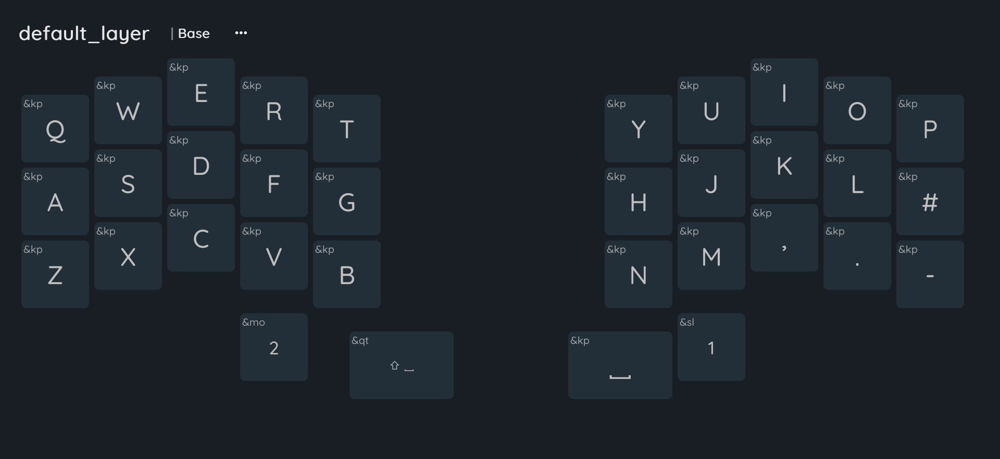
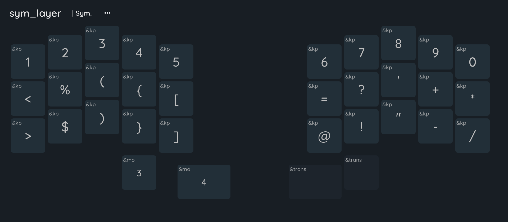
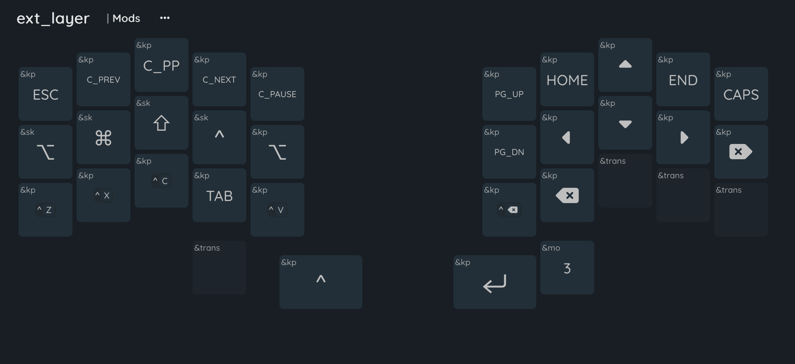
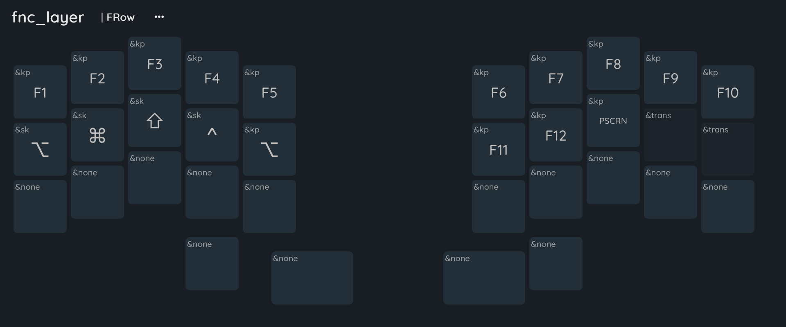
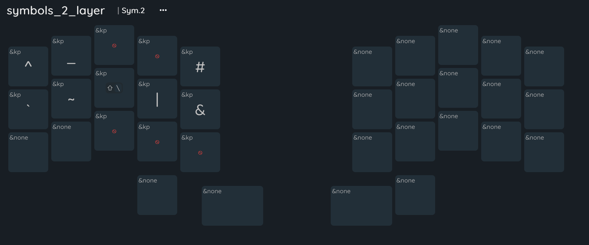
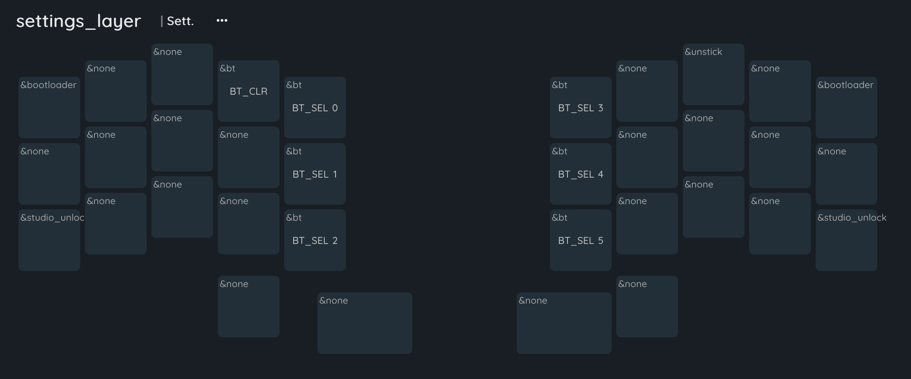

Firmware for: [Urchin Keyboard](https://github.com/duckyb/urchin)

## Getting started

**Are you trying to make your own ZMK firmware?**
[Here are the steps you need to take.](./GETTING_STARTED.md)

**Do you want to download my keymap?**

> [!IMPORTANT]
> My firmware only matches the following diagram if the operating system is set
> to "German" keyboard input.

[Download the firmware zip from the latest action run.](https://github.com/duckyb/zmk-urchin/actions/workflows/build.yml?query=is%3Asuccess+branch%3Amaster)
Check [the ZMK docs](https://zmk.dev/docs/user-setup#installing-the-firmware)
for instructions on how to flash it.

## Keymap Editor

I've added the `info.json` for the [online keymap editor from nickcoutsos](https://nickcoutsos.github.io/keymap-editor/).
It's not perfect, but it works and does it's thing.

## Keymap Cheat Sheet

This layout is inspired by [Urchin by duckyb](https://github.com/duckyb/urchin-zmk-firmware)

[See it in action on YouTube!](https://youtu.be/IZ83uU0ltaE)

